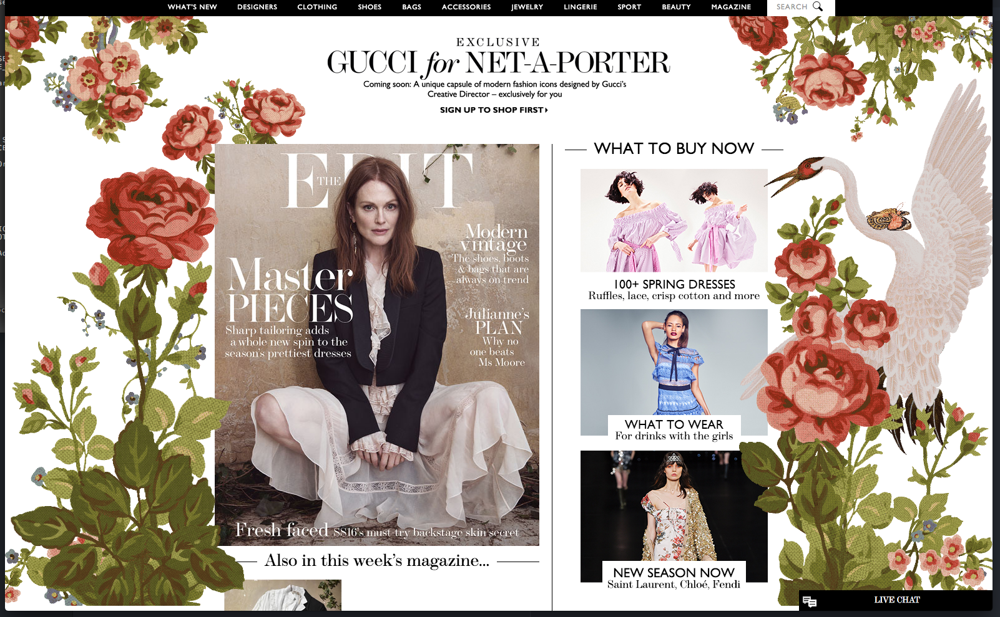

# Net-a-Porter x Gucci campaign homepage background



I thought it looked cute so I took it. N-A-P is using an iFrame on their homepage to display the html canvas with the flowers/birds and their accompanying animations, take that as you will.

See [Net-a-Porter](https://www.net-a-porter.com/) for it live idk.

# To run

Because of the createjs loader that's getting the json file, the page won't work if you open index.html from your local file system. So set up a local server.

Assuming you have python installed:

```bash
python -m SimpleHTTPServer
```

Then just go to http://localhost:8000 in your browser of choice.

# Todo

Get that snake in there! (it's a video being displayed on another canvas element, shouldn't be too hard.)

# Contributing

If you want, I guess?
